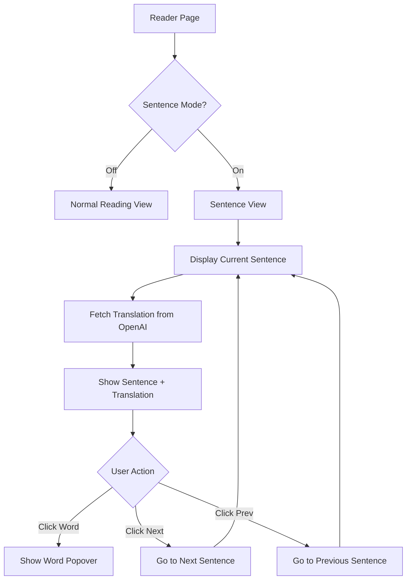

# Sentence Mode Feature Implementation

## Feature Overview

Add a toggle in the Reader header to switch between:

- **Normal Mode**: Full text with word highlighting (current behavior)
- **Sentence Mode**: One sentence at a time with translation below, navigation buttons

## User Flow




## Implementation

### 1. Add Sentence Parsing Utility

Create helper function to split content into sentences:

```typescript
// Split text into sentences, handling abbreviations and edge cases
const parseSentences = (content: string): string[] => {
  // Split on . ! ? followed by space or end, but not abbreviations
  return content
    .split(/(?<=[.!?])\s+/)
    .filter(s => s.trim().length > 0);
};
```


### 2. Update Reader State

Add to [`src/pages/Reader.tsx`](src/pages/Reader.tsx):

```typescript
// Sentence mode state
const [sentenceMode, setSentenceMode] = useState(false);
const [currentSentenceIndex, setCurrentSentenceIndex] = useState(0);
const [sentenceTranslations, setSentenceTranslations] = useState<Record<number, string>>({});
const [loadingTranslation, setLoadingTranslation] = useState(false);

// Parse sentences from lesson content
const sentences = useMemo(() => {
  if (!lesson?.content) return [];
  return parseSentences(lesson.content);
}, [lesson?.content]);
```


### 3. Add Sentence Translation Function

Leverage existing `useTranslation` hook or create a dedicated function:

```typescript
const translateSentence = async (sentence: string, index: number) => {
  if (sentenceTranslations[index]) return; // Already cached
  
  setLoadingTranslation(true);
  try {
    const result = await translate(sentence, lesson.language, nativeLanguage);
    setSentenceTranslations(prev => ({ ...prev, [index]: result.translation }));
  } finally {
    setLoadingTranslation(false);
  }
};
```


### 4. Add Toggle Button to Header

Add sentence mode toggle next to existing mode buttons:

```typescript
<Tooltip>
  <TooltipTrigger asChild>
    <Button
      variant={sentenceMode ? "default" : "ghost"}
      size="icon"
      onClick={() => {
        setSentenceMode(!sentenceMode);
        setCurrentSentenceIndex(0);
      }}
    >
      <AlignJustify className="w-5 h-5" />
    </Button>
  </TooltipTrigger>
  <TooltipContent>Sentence Mode</TooltipContent>
</Tooltip>
```


### 5. Create Sentence View Component

Create [`src/components/reader/SentenceView.tsx`](src/components/reader/SentenceView.tsx):

- Display current sentence with word tokenization (preserve word clicks)
- Show translation below sentence
- Navigation: Previous / Sentence counter / Next buttons
- Progress indicator (e.g., "3 of 25")
- Auto-fetch translation when sentence changes

### 6. Conditional Rendering in Reader

```typescript
{sentenceMode ? (
  <SentenceView
    sentences={sentences}
    currentIndex={currentSentenceIndex}
    translation={sentenceTranslations[currentSentenceIndex]}
    loadingTranslation={loadingTranslation}
    onNext={() => setCurrentSentenceIndex(i => Math.min(i + 1, sentences.length - 1))}
    onPrev={() => setCurrentSentenceIndex(i => Math.max(i - 1, 0))}
    onWordClick={handleWordClick}
    // Pass word status props for highlighting
  />
) : (
  // Existing normal reading view
)}
```


## Files to Modify/Create

| File | Action ||------|--------|| `src/pages/Reader.tsx` | Add sentence mode state, toggle, conditional rendering || `src/components/reader/SentenceView.tsx` | **Create** - Sentence display with navigation || `src/hooks/useTranslation.ts` | Ensure sentence-level translation works (already supports phrases) |

## UI Design

```javascript
┌─────────────────────────────────────────┐
│ [←] Title           [Mode] [🔊] [⚙️]   │  ← Sentence toggle added
├─────────────────────────────────────────┤
│                                         │
│   "Der Hund läuft schnell durch        │  ← Current sentence
│    den Park."                           │     (words still clickable)
│                                         │
│   ─────────────────────────────         │
│   "The dog runs quickly through        │  ← Translation (below)
│    the park."                           │
│                                         │
├─────────────────────────────────────────┤
│     [← Prev]    3 / 25    [Next →]     │  ← Navigation
└─────────────────────────────────────────┘


```